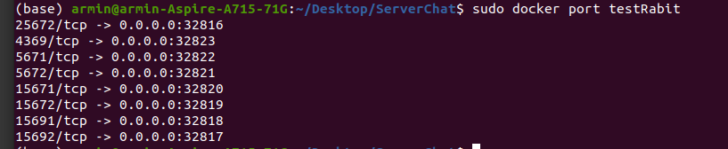

## Simple Chat server using websocket

This project is a good training for websockets, channels and Rabitmq .

## Features 

* Chat with other users 
* Save messages for user and showing them after connecting to server 

## Installation
`go get github.com/nhooyr/websocket` ( I used this package instead of gorilla )

pulling rabbitmq image `docker pull rabbitmq`

running rabbitmq container `sudo docker run -d --name testRabit -P rabbitmq:management`

`sudo docker port testRabit` replace the "rabitPort" in rabitmq.go with the port befor the last port 

`go run *.go`

[install websocat](https://github.com/vi/websocat) 

Adding a client to server chat `websocat ws:\\127.0.0.1:8080\`

Register user `{"id":your id}`

sending message `{"target":target Id ,"msg":your msg }`

## This project is a good practice for : 

[using context](https://blog.golang.org/context)

[websockets](https://github.com/nhooyr/websocket)

[Rabbitmq](https://www.rabbitmq.com/)

[net package in go](https://golang.org/pkg/net/)

